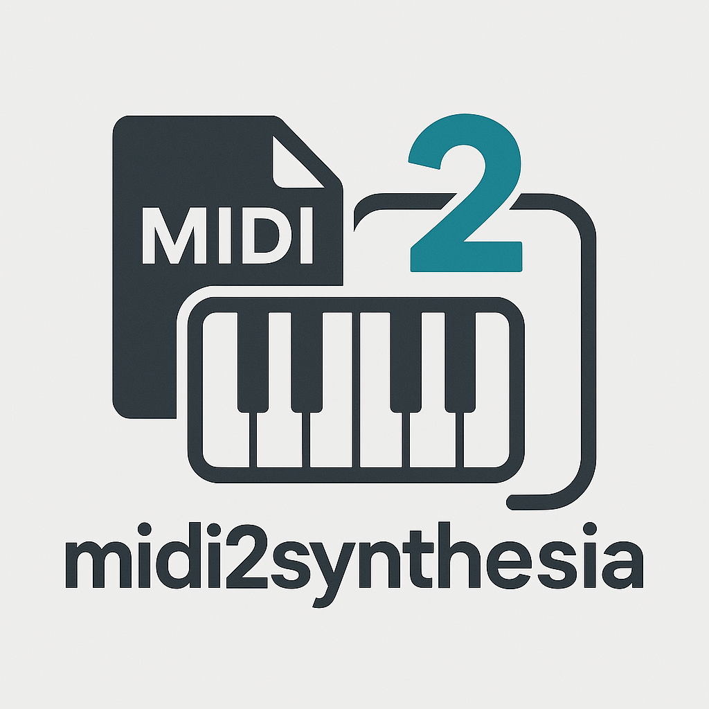
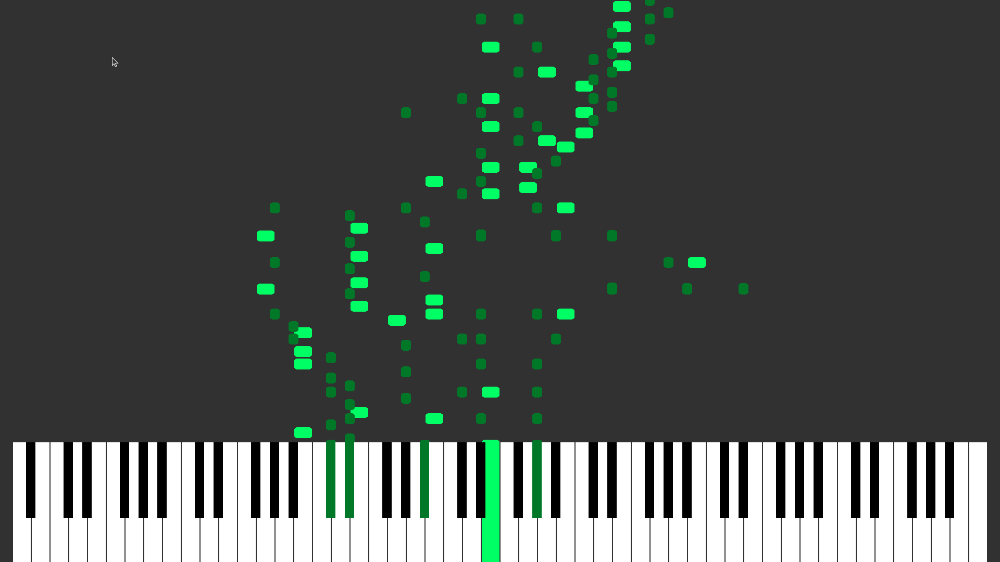

# 🎹 MIDI2Synthesia
A tool for converting midi input to synthesia-style piano visuals



---

## Requirements

To build and run MIDI2Synthesia, you'll need the following dependencies:

- `gcc` (C compiler)
- [`SDL3`](https://github.com/libsdl-org/SDL)
- `SDL3_gfx`
- `SDL3_ttf`
- [`glib-2.0`](https://developer.gnome.org/glib/)
- [`libsmf`](https://sourceforge.net/projects/libsmf/)
- `portmidi`
- `make` (for building with Makefile)

**Header includes** assumed in:
- `/usr/local/include`
- `/usr/include`

**Libraries** assumed in:
- `/usr/local/lib`

---

## 🛠️ Installation & building

Clone the Repository

`git clone https://github.com/nosafesys/midi2synthesia
cd midi2synthesia`

Before building, make sure to install the required libraries. Here's an example using `apt` (Debian/Ubuntu-based systems):

```bash
sudo apt update
sudo apt install build-essential libsdl3-dev libsdl3-gfx-dev libsdl3-ttf-dev libglib2.0-dev libportmidi-dev

The libsmf library has to be manually installed and built. You can find the repository here: [`libsmf`](https://github.com/stump/libsmf)

Build the Project Run the following command in your terminal:

```make

After a successful build, you can run the application using the following command

```./build/midi2synthesia
